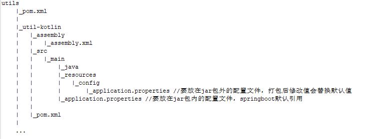

maven-assembly-plugin 插件打包
-----------------------------------------------------
#### 场景
springboot + maven 支持[spring-boot-maven-plugin插件打包](spring-boot-maven-plugin.md)<br/>
当我们打完包之后，想要修改数据源，就得修改`application.properties`，然后重新打包 _`没源码或源码变了就GG了`_ 。<br/>
那么我们可以加maven-assembly-plugin插件来把项目的数据源、日志、缓存路径等配置`application.properties`放在打完的jar包外面。
这样打出来的包，可以随时修改`application
.properties`,即可动态修改配置 _`ps源码什么的可不管我什么事:)`_

#### 使用步骤
pom.xml 中添加插件
```
<!--引用：详细配置在parent/pom.xml中-->
<build>
    <plugins>
        <plugin>
            <groupId>org.springframework.boot</groupId>
            <artifactId>spring-boot-maven-plugin</artifactId>
        </plugin>
        <plugin>
            <artifactId>maven-assembly-plugin</artifactId>
        </plugin>
    </plugins>
</build>
```
parent/pom.xml
```
<build>
    <plugins>
        <!-- 使用spring boot的maven插件进行打包 -->
        <plugin>
            <groupId>org.springframework.boot</groupId>
            <artifactId>spring-boot-maven-plugin</artifactId>
            <executions>
                <execution>
                    <goals>
                        <goal>build-info</goal>
                    </goals>
                </execution>
            </executions>
            <configuration>
                <!-- 是否打出可执行的jar包(仅支持Linux格式) -->
                <executable>false</executable>
            </configuration>
        </plugin>
        <!-- 将jar包和外部配置等文件整体打包(zip,tar,tar.gz等) -->
        <plugin>
            <artifactId>maven-assembly-plugin</artifactId>
            <configuration>
                <!--jar包名称-->
                <finalName>${project.artifactId}-${project.version}</finalName>
            </configuration>
            <executions>
                <execution>
                    <id>full</id>
                    <!-- 绑定到package生命周期阶段上 -->
                    <phase>package</phase>
                    <goals>
                        <!-- 只运行一次 -->
                        <goal>single</goal>
                    </goals>
                    <configuration>
                        <!--描述文件路径-->
                        <descriptor>${basedir}/assembly/assembly.xml</descriptor>
                    </configuration>
                </execution>
            </executions>
        </plugin>
    </plugins>
</build>
```

配置比较多而且比较固定，所以可以在parent工程(utils)中声明，在要打包的项目(util-kotlin)中引用，以上配置参考路径<br/>


assembly.xml 配置
```
<assembly xmlns="http://maven.apache.org/ASSEMBLY/2.0.0"
          xmlns:xsi="http://www.w3.org/2001/XMLSchema-instance"
          xsi:schemaLocation="http://maven.apache.org/ASSEMBLY/2.0.0 http://maven.apache.org/xsd/assembly-2.0.0.xsd">
    <!--这个id会跟在打包文件后面，现还不清楚怎么取消-->
    <id>jar</id>
    <formats>
        <format>tar.gz</format>
    </formats>
    <fileSets>
        <fileSet>
            <!--打包时把/resources/config 目录内的文件放在jar包外的/目录下-->
            <directory>${project.build.directory}/classes/config</directory>
            <outputDirectory>/</outputDirectory>
            <fileMode>0755</fileMode>
        </fileSet>
    </fileSets>
    <files>
        <!--打包时把README.md文件放在jar包外-->
        <file>
            <source>README.md</source>
            <outputDirectory></outputDirectory>
        </file>
        <file>
            <!--打好的jar包名称和放置目录-->
            <source>${project.build.directory}/${project.build.finalName}.jar</source>
            <outputDirectory>/</outputDirectory>
        </file>
    </files>
</assembly>
```
关于更多配置请查看[官方文档](http://maven.apache.org/plugins/maven-assembly-plugin/assembly.html)<br/>
参考<br/>
[http://blueram.iteye.com/blog/1684070](http://blueram.iteye.com/blog/1684070)
[http://maven.apache.org/plugins/maven-assembly-plugin/](http://maven.apache.org/plugins/maven-assembly-plugin/)
[http://blog.csdn.net/WANGYAN9110/article/details/38646677](http://blog.csdn.net/WANGYAN9110/article/details/38646677)