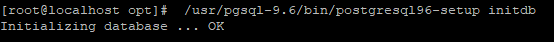
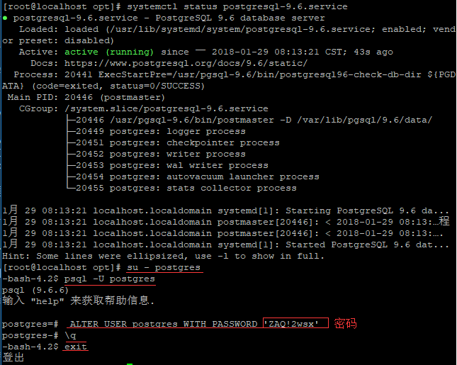
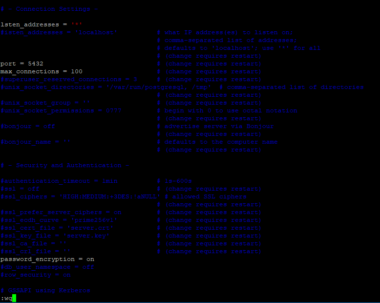
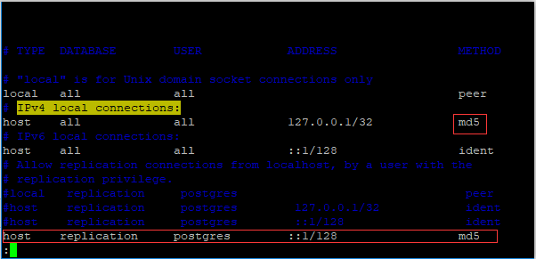

Centos7 PostgreSQL 9.6 安装
---------------------------

1.首先安装PostgreSQL的rpm
```
 yum install https://download.postgresql.org/pub/repos/yum/9.6/redhat/rhel-7-x86_64/pgdg-centos96-9.6-3.noarch.rpm
```
2.然后再安装PostgreSQL服务器和第三方扩展包 默认安装在 **/usr/pgsql-9.6/**
```
yum install postgresql96-server postgresql96-contrib -y
```
3.1 首先在 **/opt** `这个随便` 下创建一个Postgresql的数据目录
```
mkdir /home/postgresql_data
```
3.2 然后为这个目录指定所有者同时分配权限
```
chown postgres:postgres /opt/postgresql_data

chmod 750 /opt/postgresql_data
```
3.3然后设置环境变量
>vi /etc/profile
末尾添加如下
```
export PATH=/usr/pgsql-9.5/bin:$PATH

export LD_LIBRARY_PATH=/usr/pgsql-9.5/lib

export PGDATA=/home/postgresql_data
```
ESC <br/>
Shift+;<br/>
wq<br/>
回车保存<br/>
刷新环境变量<br/>
source /etc/profile<br/>

4.初始化数据库
```
/usr/pgsql-9.6/bin/postgresql96-setup initdb
```


5.设置开机自启动
```
systemctl enable postgresql-9.6.service
```
6.启动服务
```
systemctl start postgresql-9.6.service
```
7.修改用户密码<br/>
    su - postgres  切换用户，执行后提示符会变为 '-bash-4.2$'<br/>
    psql -U postgres 登录数据库，执行后提示符变为 'postgres=#'<br/>
    ALTER USER postgres WITH PASSWORD 'ZAQ!2wsx'  设置postgres用户密码<br/>
    \q  退出数据库<br/>



8.开启远程访问
vi /var/lib/pgsql/9.6/data/postgresql.conf<br/>
修改#listen_addresses = 'localhost'  为  listen_addresses='*'<br/>
当然，此处\*也可以改为任何你想开放的服务器IP<br/>
然后将 #port = 5432 前的#去掉,最后再将 #password_encryption = on 前面的#号去掉<br/>




9.信任远程连接
vi /var/lib/pgsql/9.5/data/pg_hba.conf
