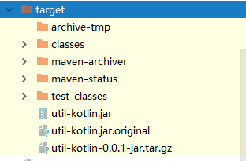

spring-boot-maven-plugin插件打包
------------------------------------------------------------
#### 场景
springboot 打包成可执行jar
#### 配置
pom.xml
```
<build>
    <plugins>
        <!-- 使用spring boot的maven插件进行打包 -->
        <plugin>
            <groupId>org.springframework.boot</groupId>
            <artifactId>spring-boot-maven-plugin</artifactId>
            <executions>
                <execution>
                    <goals>
                        <goal>build-info</goal>
                    </goals>
                </execution>
            </executions>
            <configuration>
                <!-- 是否打出可执行的jar包(仅支持Linux格式) -->
                <executable>true</executable>
            </configuration>
        </plugin>
    </plugins>
</build>
```
#### 效果
配置好后 执行 **`mvn clean package -DskipTests`** <br/> `说明：先清理(clean) 然后跳过测试代码(-DskipTests)打包(package)`<br/>
打包后生成target目录如下<br/>

1. 改名`util-kotlin.jar.original`为`util-kotlin.jar`可直接 **_`java -jar util-kotlin.jar`_** 执行
2. 使用 **maven-assembly-plugin 插件打包** 得到的 ``util-kotlin-0.0.1-jar.tar.gz`` 直接解压可用

更多请参考[官方文档](https://docs.spring.io/spring-boot/docs/current/maven-plugin/usage.html)<br/>
参考<br/>
[http://api.consumer.ecentm.com:9100/cashout/hs1/notify-back](http://api.consumer.ecentm.com:9100/cashout/hs1/notify-back)
[http://blog.csdn.net/smilecall/article/details/56288972](http://blog.csdn.net/smilecall/article/details/56288972)
