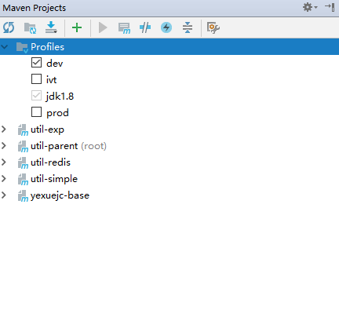

### 多环境配置

pom.xml引入
``` 
<!--多环境配置-->
<build>
    <filters>
        <filter>src/main/filters/filter-${env}.properties</filter>
    </filters>
<build>
...
<profiles>
    <!--本地环境-->
    <profile>
        <id>dev</id>
        <properties>
            <env>dev</env>
        </properties>
    </profile>
    <!--测试环境-->
    <profile>
        <id>ivt</id>
        <properties>
            <env>ivt</env>
        </properties>
    </profile>
    <!--正式环境-->
    <profile>
        <id>prod</id>
        <properties>
            <env>prod</env>
        </properties>
    </profile>
</profiles>
...
```
在Maven Projects选择本地环境


即 `filter-${env}.properties`中`${env}`指向`<env>dev</env>`
时环境配置文件为实际指向`src/main/filters/filter-dev.properties`


*********************************
>详细配置

使用maven过滤器,因spring中使用${}占位符,所以spring-boot-starter-parent将maven过滤器的占位符改为@...@

所以我们 application.properties如下配置
```
server.port=@server.port@
```
filter-dev.properties
```
server.port=8700
```

filter-dev.properties 中的`server.port` 替换application.properties中的`@server.port@`

这样在编译结束后 application.properties 内容就会变成`server.port=8700`